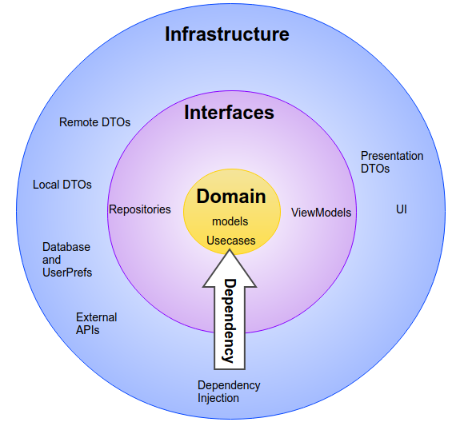

# Near Places

An App project whose goal is to locate the user's nearest Cafes, Bars and Restaurants.

## Architecture
The app uses a variation of Clean Architecture for the App's architecture, integrated with MVVM 
for the presentation layer.
Conceptually, the architecture is as follows:

When implemented, this architecture assumes the format of Clean Architecture on Android:

## Stack
- **Languages**
  - Java
  - Kotlin
  
- **Architectures, Models and Paradigms**
  - MVVM
  - Clean Architecture
  - Repository
  - Reactive Programming
  
- **Persistence**
  - Room
  - Hawk
  
- **Logging, Control and Monitoring**
  - Timber
  - Stetho
  
- **Other Libs**
  - RxJava2
  - Dagger2
  - Retrofit
  - Android Paging 3

